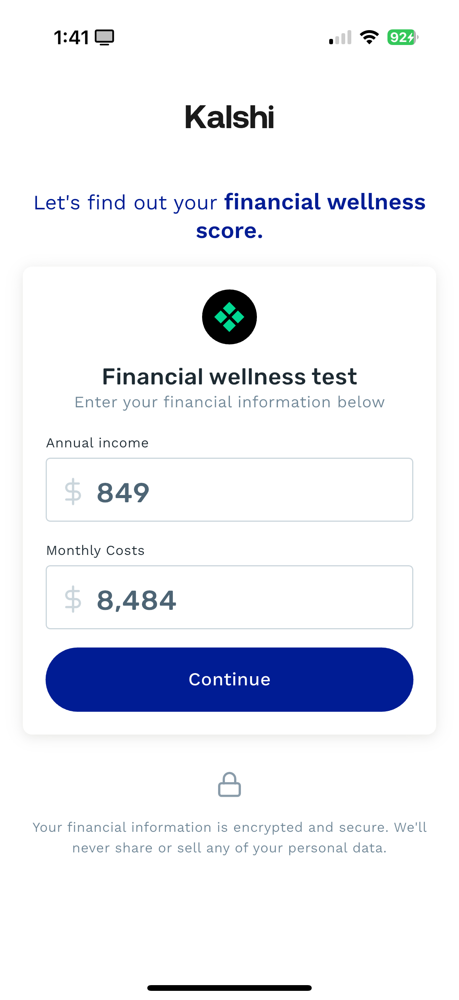
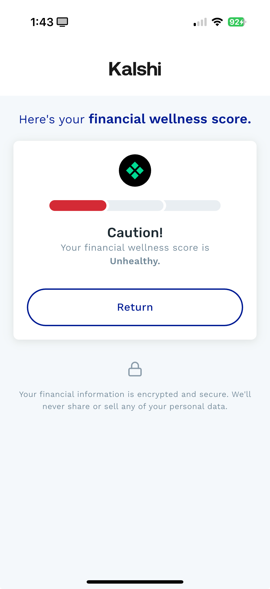
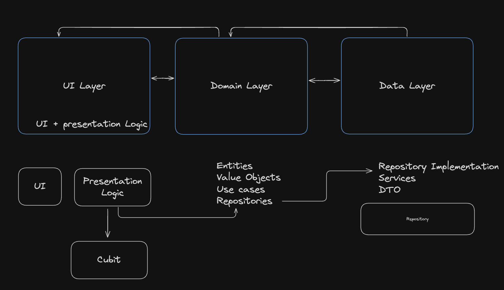
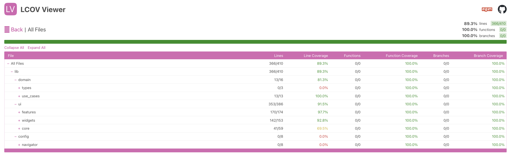

# Wellness Score App

|  |  |
| :------------------------------------------: | :--------------------------------------: |

## Table of Contents
- [Wellness Score App](#wellness-score-app)
  - [Table of Contents](#table-of-contents)
- [Overview](#overview)
    - [How to run the app](#how-to-run-the-app)
    - [How to run the tests](#how-to-run-the-tests)
  - [Architecture](#architecture)
  - [Directory Structure](#directory-structure)
      - [Architecture Diagram](#architecture-diagram)
  - [Key decisions](#key-decisions)
  - [Business rules](#business-rules)
    - [Step-by-Step Execution](#step-by-step-execution)
      - [Receives Inputs](#receives-inputs)
      - [Applies Tax Rate](#applies-tax-rate)
      - [Calculates Cost-to-Income Ratio](#calculates-cost-to-income-ratio)
      - [Determines Financial Health Score](#determines-financial-health-score)
      - [Threshold logic:](#threshold-logic)
      - [Logs Event to Analytics](#logs-event-to-analytics)
      - [Returns the Result](#returns-the-result)
      - [Example Calculation](#example-calculation)
  - [Theme and Tokens](#theme-and-tokens)
  - [Testing \& Coverage](#testing--coverage)
  - [Future improvements](#future-improvements)
    - [User Experience (UX/UI) Enhancements](#user-experience-uxui-enhancements)
    - [Business Logic \& Score Accuracy Enhancements](#business-logic--score-accuracy-enhancements)
    - [Service Improvements](#service-improvements)
  - [Git and Branching Strategy (Suggestion)](#git-and-branching-strategy-suggestion)
    - [How to merge a feature branch into main](#how-to-merge-a-feature-branch-into-main)
      - [Sync](#sync)
      - [Development Workflow](#development-workflow)
  - [Contact](#contact)


# Overview
The Financial Wellness Score App is a Flutter-based application that calculates a financial health score based on a user's income and expenses. The app follows a structured architecture, ensuring modularity, scalability, and maintainability.

### How to run the app

```bash
flutter pub get
flutter pub run build_runner build -d
flutter run
```


### How to run the tests

```bash
flutter test
```


## Architecture
The project follows a clean architecture approach, separating concerns into different layers:

- Presentation Layer (UI): Handles user interactions and UI rendering.
- Domain Layer: Contains business logic and use cases.
- Data Layer: Manages data sources (repositories, APIs, local storage).

## Directory Structure

```bash
lib/
├── config/         # Configuration files (assets, constants, DI, navigation)
│   ├── di/         # Dependency Injection
│   ├── navigator/  # Navigation
│   ├── assets/     # Assets
│   ├── constants/  # Constants
├── data/           # Data sources and repositories
├── domain/         # Business logic (use cases, repositories, entities)
├── ui/             # Presentation layer (widgets, screens, state management)
│   ├── core/       # Shared UI components (theme)
│   │   ├── theme/  # Theming system (colors, typography, sizes)
│   │   ├── shared_widgets/   # Shared widgets
│   ├── widgets/    # Reusable UI widgets
│   ├── features/   # Feature-specific UI components
└── main.dart       # Application entry point
```

#### Architecture Diagram



## Key decisions

Many of the decisions were made based on the need to have a flexible and scalable architecture, and we also believe in the future this app will grow.
If the previous assumptions are not true, maybe we should have a different approach.

- Navigation: We decided to use GoRouter for navigation.
- Dependency Injection: We decided to use GetIt for dependency injection.
- Theme: We decided to use a custom theme system.
- Architecture: MVVM based on the Clean Architecture.
- State Management: We decided to use Cubit for state management.

## Business rules
We decided to use the following approach for the business logic, creating a UseCase to encapsulate the business rules:

```dart
class HealthScoreUseCase {
  final AnalyticsRepository _analyticsRepository;

  HealthScoreUseCase(this._analyticsRepository);

  static const _TAX_RATE = 0.08;
  static const _HEALTHY_THRESHOLD = 0.25;
  static const _MEDIUM_THRESHOLD = 0.75;

  HealthStatus call({
    required double annualIncome,
    required double monthlyCosts,
  }) {
    assert(
      annualIncome > 0 && monthlyCosts > 0,
      'Annual income and monthly costs must be greater or equal to 0',
    );

    final annualNetIncome = annualIncome * (1 - _TAX_RATE);
    final annualCosts = monthlyCosts * 12;
    final costRatio = annualCosts / annualNetIncome;

    HealthStatus result = HealthStatus.low;

    if (costRatio <= _HEALTHY_THRESHOLD) {
      result = HealthStatus.healthy;
    } else if (costRatio <= _MEDIUM_THRESHOLD) {
      result = HealthStatus.medium;
    }

    _trackHealthScore(annualIncome, monthlyCosts, result);

    return result;
  }

  void _trackHealthScore(
    double annualIncome,
    double monthlyCosts,
    HealthStatus result,
  ) {...}
}
```

### Step-by-Step Execution

#### Receives Inputs

The use case is called with:
- annualIncome: User's yearly income.
- monthlyCosts: User's total monthly expenses.

#### Applies Tax Rate

The net annual income is calculated by applying an 8% tax rate:
```dart
final annualNetIncome = annualIncome * (1 - _TAX_RATE);
```

#### Calculates Cost-to-Income Ratio

The total annual costs are computed:
```dart
final annualCosts = monthlyCosts * 12;
```

The cost ratio is then calculated:
```dart
final costRatio = annualCosts / annualNetIncome;
```

#### Determines Financial Health Score

The cost ratio is compared against defined thresholds:
```dart
HealthStatus result = HealthStatus.low;

if (costRatio <= _HEALTHY_THRESHOLD) {
  result = HealthStatus.healthy;
} else if (costRatio <= _MEDIUM_THRESHOLD) {
  result = HealthStatus.medium;
}
```

#### Threshold logic:
Healthy: Cost ratio ≤ 25%
Medium: Cost ratio > 25% and ≤ 75%
Low: Cost ratio > 75%

#### Logs Event to Analytics

The result is logged via an analytics repository:
```dart
_trackHealthScore(annualIncome, monthlyCosts, result);
```

#### Returns the Result

The function returns a HealthStatus (healthy, medium, or low) based on the calculations.

#### Example Calculation

Example 1 (Healthy)
| Annual Income | Monthly Costs | Net Annual Income | Annual Costs | Cost Ratio    | Health Score |
| ------------- | ------------- | ----------------- | ------------ | ------------- | ------------ |
| $100,000      | $1,500        | $92,000           | $18,000      | 0.195 (19.5%) | Healthy ✅    |
| $100,000      | $4,000        | $92,000           | $48,000      | 0.521 (52.1%) | Medium ⚠️     |
| $100,000      | $7,500        | $92,000           | $90,000      | 0.978 (97.8%) | Low 🔴        |


## Theme and Tokens

We decided to use a custom theme system, with tokens for colors, typography, and sizes.


```dart
final colors = context.colors;     // Access color scheme
final sizes = context.sizes;       // Get predefined sizes (padding, margins)
final typography = context.typography;  // Retrieve text styles
```

Using Theme Sizes for Spacing

```dart
SizedBox(height: context.sizes.x4), // 16px spacing
Padding(padding: context.sizes.x5.paddingHorizontal), // 20px horizontal padding
```

Using Theme Typography for Text Styles

```dart
Text(
  'Welcome to the App',
  style: context.typography.headlineLarge,
);
```


## Testing & Coverage

We want to maintain a good coverage of the code, and we want to test the business rules and the UI.
The most important is the domain layer has a 80% of coverage or more.

We want to create unit tests for the business rules and widget tests for the UI.




## Future improvements

Here's a list of **feature improvements** that could enhance the user experience, functionality, and scalability:

### User Experience (UX/UI) Enhancements
1. **Dark Mode Support**: Implement a dark theme for better usability.
2.  **Multi-language Support**: Implement localization (`intl`) to support multiple languages.
3. **Animations**: Use `Animations` for better visual feedback and transitions.
4. **Support for different screen sizes**: Support for different screen sizes.

### Business Logic & Score Accuracy Enhancements
1. **More Variables in Score Calculation**: Include factors like debt, savings, and investments for a more accurate financial score.
2. **Score History Tracking**: Let users view their financial progress over time.


### Service Improvements
1. **API Synchronization**: Integrate with a API to save and fetch the user's data.
2. **Export Results**: Allow users to download their score as a PDF or share it on social media.
3. **Encryption**: Encrypt the user's data.


## Git and Branching Strategy (Suggestion)

We use the following branching strategy:

- `main`: The main branch.
- `feature/...`: A feature branch.
- `hotfix/...`: A hotfix branch.

### How to merge a feature branch into main

#### Sync

Pulling origin main to local main (from main)
```bash
git pull origin main --ff
```

- If you have local changes, please try to avoid creating a merge commit
- Stash your changes
- Move your changes to a temporal branch → reset your local main with origin → merge your temporal branch
- Use git pull origin main --rebase (Use when your local changes are different to remote changes to avoid a lot of ‘conflict solution’)

Pulling main to own branch (from <branch>)
```bash
git pull origin main --no-rebase
```


Sync main back to staging (from staging) (same from staging to develop)
```bash
git pull origin main --no-rebase
```


#### Development Workflow
- Make sure you are working from main with the latest changes.
- Pull origin main
- Checkout to your branch named feature/WS-xxxx-Feature-name-Short-description
- Create a PR with the implementation.
- Push the changes to origin
- Rebase main (git pull origin main --rebase)
- Resolve conflicts if needed.
- git push -f origin <branch>
- Request review from reviewers.
- *Squash merge* to main when approved.


## Contact

If you have any questions or suggestions, please contact us at:

- [Linkedin](https://www.linkedin.com/in/jamescardona11/)
- [Github](https://github.com/jamescardona11)
